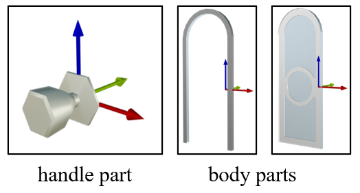
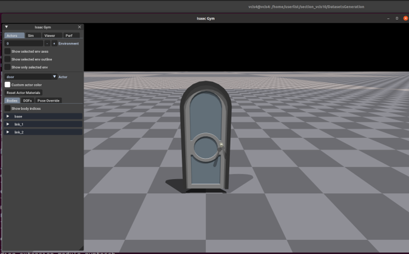

# Dataset Generation
We release our method of dataset generation. Provided by the method, you can integrate you own designed doors with the parts.

## Download
Please download the door parts [**here**](https://drive.google.com/uc?export=download&id=1veSBW7lOcL17k8RujcrEOnGubTSXLxGl) and unzip it in this folder.
Here we show an example of our part dataset including handle and body.


## Assets Generation
For each category, we provide a specific python script for assets generation. You can simply run the code by using the shell scripts to generate the doors.
```shell
   bash generate_[category]_datasets.sh
```
The python scripts have two hyperparameters:  ```[category-body-list]``` and ```[category-handle-list]```. You can input the body/handle id into the list for composition. Part id can be found in the assets folder.

Here, you can run the following code to generate round handle doors composed of the upper handle and body examples.
```shell
   bash generate_round_door_datasets.sh
```
The generated door assets will be in this directory ```DatasetsGeneration/generated_datasets/[category]```. You can modify the output path by adding ```--save_path 'your/path'``` to the specified shell script.

## Assets Testing
We provide a simple simlulation environment to check the generated door asset.
```shell
   python door_asset_test.py
```
The mesh and urdf model of the door asset are rendered in the IsaacGym below.

