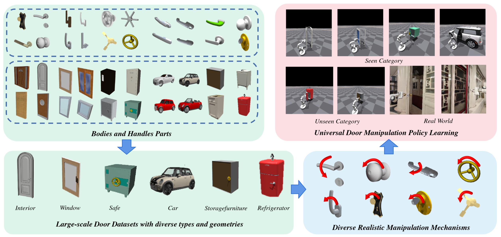
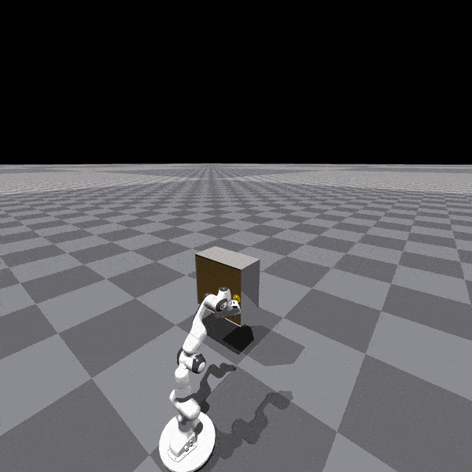

<h2 align="center">
  <b>UniDoorManip: Learning Universal Door Manipulation Policy Over Large-scale and Diverse Door Manipulation Environments</b>
</h2>

This is the official repository of UniDoorManip: Learning Universal Door Manipulation Policy Over Large-scale and Diverse Door Manipulation Environments.


## Dataset
Our dataset consists of the door parts (bodies and handles), and the integrated doors across six categories(Interior, Window, Car, Safe, StorageFurniture, Refrigerator).
The door parts are selected from [**PartNet-Mobility**](https://sapien.ucsd.edu/) and [**3d Warehouse**](https://3dwarehouse.sketchup.com/). We annotate the part axis and poses and develop a method to integrate the parts into the doors.

Here we have already constructed some door examples, you can download the pakage [**here**](https://drive.google.com/uc?export=download&id=1Tkkgyn9slUXmcxYcbTKa1Rj3QeM74SbL). 

For more details about the method of parts integration, please refer to the DatasetGeneration directory.
<!--
Both include object assets and images, annotations of part pose and the rendered pointcloud. 
Examples are in the dataset directory and visualized below. 

To obtain the door parts, please download the pakage [**here**](https://drive.google.com/uc?export=download&id=1Tkkgyn9slUXmcxYcbTKa1Rj3QeM74SbL). 

To obtain the integrated door, please download the pakage [**here**](https://drive.google.com/uc?export=download&id=1Tkkgyn9slUXmcxYcbTKa1Rj3QeM74SbL). 

For more details about our dataset, please refer to the DatasetGeneration directory.
-->

<!--
## How to extend the dataset
We release our method of dataset construction. Provided by the method, the dataset is easily scaled to large. See Dataset-Process folder for more information
-->
## Simulation
We provide individual simulation environments for each category and mechanism. Here we show some task demos with a movable robot arm. 
<table>
    <tr>
        <td ><center> Interior </center></td>
        <td ><center>Window</center></td>
    </tr>
    <tr>
        <td ><center> Car </center></td>
        <td ><center>Safe</center></td>
    </tr>
    <tr>
        <td ><center> StorageFurniture </center></td>
        <td ><center>Refrigerator</center></td>
    </tr>
</table>


## How to use our code
Here we introduce the procedure to run the simulation using the doors integrated by us.

### Downloading
Please download the integrated door pakages [**here**](https://drive.google.com/uc?export=download&id=1Tkkgyn9slUXmcxYcbTKa1Rj3QeM74SbL) and unzip it in the repository directory.

### Installation
This repository has been developed and tested with Ubuntu 20.04 and CUDA 11.7. To set up the environments, please follow these steps:
1. Create a new Anaconda environment named unidoormanip. We recommend the Python version 3.8.
   ```shell
   conda create -n unidoormanip python=3.8
   conda activate unidoormanip
   ```
2. Install the dependecies.
   ```shell
   pip install torch==1.13.1 torchvision==0.14.1 ipdb trimesh
   ```
3. Install the simulator IsaacGym following the [official guide](https://developer.nvidia.com/isaac-gym).
<!-- 5. Install the PointNet++
  ```shell
     git clone --recursive https://github.com/erikwijmans/Pointnet2_PyTorch
     cd Pointnet2_PyTorch
     pip install -r requirements.txt
     pip install -e .
  ```
  Notice that PointNet++ requires the match of CUDA version and pytorch version.
-->
### Run the simulation
We already provide the shell scripts, just run the file and you will see the simulation environments.
```shell
  cd [path_to_this_repo]/Simulation
  bash scripts/franka_slider_open_[category].sh
```
For example, if you want to use the lever door simulation, you can run the following code:
```shell
  cd [path_to_this_repo]/Simulation
  bash scripts/franka_slider_open_lever_door.sh
```


<!--
**UniDoorManip/UniDoorManip** is a ✨ _special_ ✨ repository because its `README.md` (this file) appears on your GitHub profile.

Here are some ideas to get you started:

- 🔭 I’m currently working on ...
- 🌱 I’m currently learning ...
- 👯 I’m looking to collaborate on ...
- 🤔 I’m looking for help with ...
- 💬 Ask me about ...
- 📫 How to reach me: ...
- 😄 Pronouns: ...
- ⚡ Fun fact: ...
-->
